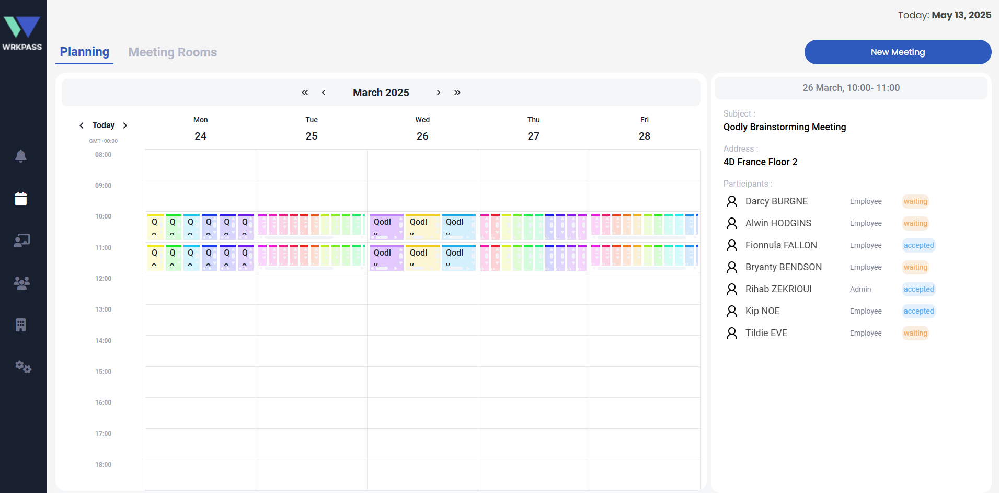
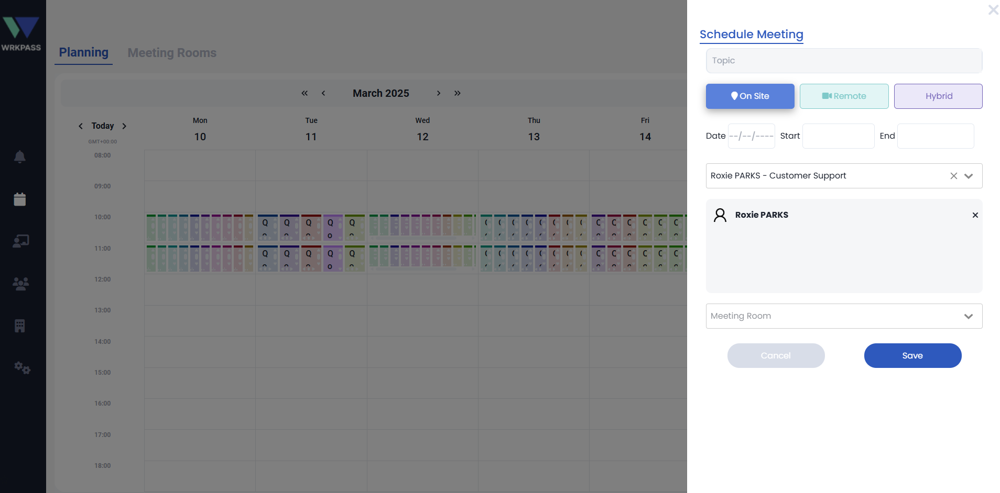
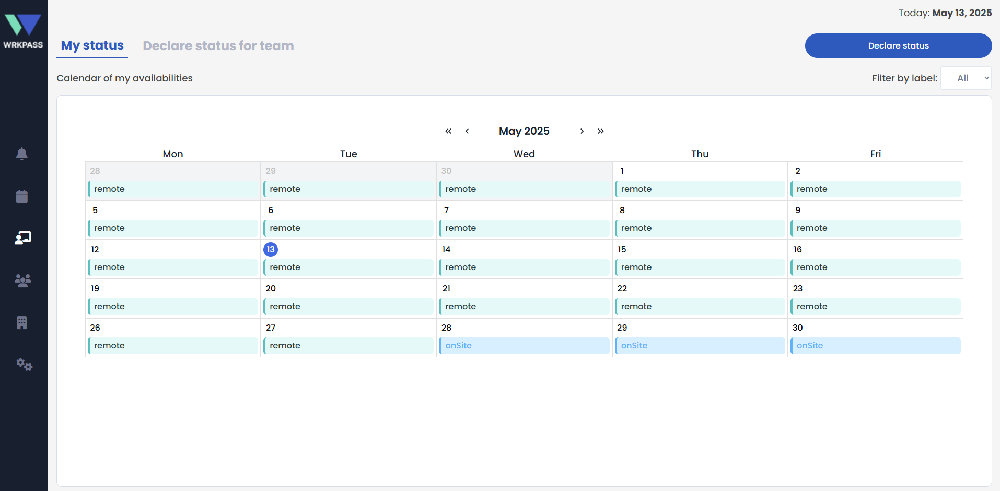
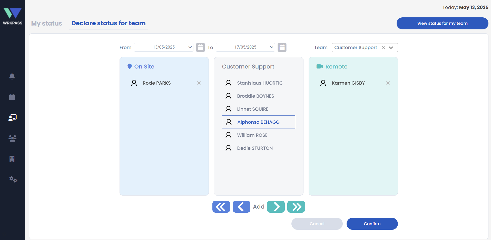
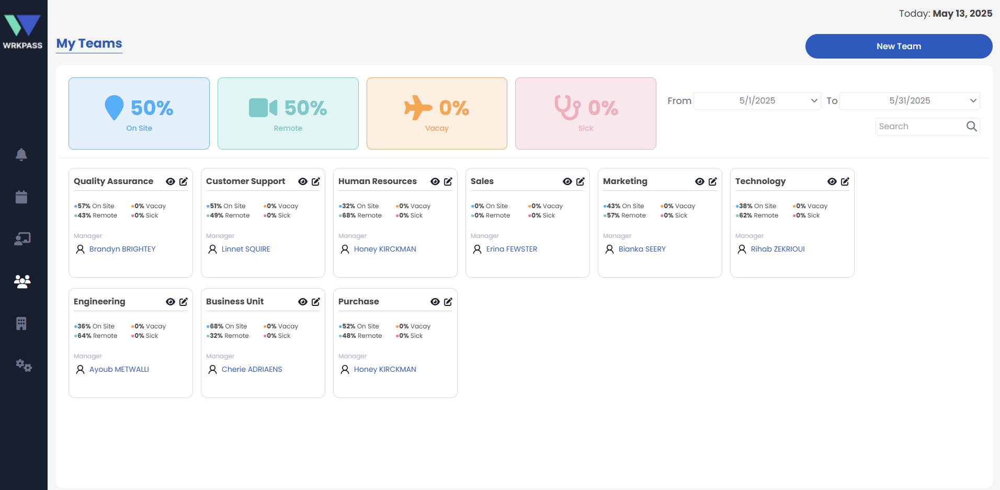

# wrkPass Application

## 🎯 Purpose of the Application

wrkPass is an all-in-one telecommuting solution designed to streamline the coordination of remote, hybrid, and onsite work.
The application allows employees to declare their work status, schedule meetings that match their availability mode, and maintain fluid communication between teams and managers. It simplifies workforce organization and ensures smooth collaboration across distributed environments.

---

## 🧩 What the Application Covers

### 🏠 Main Features

- Interactive dashboard for viewing and managing work statuses
- Dedicated pages for creating, viewing, and managing meetings

- Ability for users to declare their current work mode: Remote, Hybrid, or Onsite

- Meeting management with filtering by work status
- Managers can view and manage their team’s statuses and meetings

- Employees can view their own status history and related meetings
- Real-time overview for administrators to monitor organization-wide work modes

- Secure, role-based access ensuring proper visibility and permissions

---

### 👥 User Roles

- **Admin**  
Full control over the application. Can manage all users, all meetings, all statuses, and global configuration settings. Has unrestricted access across the platform.

- **Manager**
Can manage only their own meetings and the meetings of their team members.
Can view and manage team statuses, approve or monitor team availability, and coordinate schedules efficiently.

- **Employee**
Can declare their work status (remote, hybrid, onsite) and view their own meeting schedule and status history.
Does not have access to manage others’ data.

---

## 🚀 How to Integrate and Use the Application

### 1. Clone or Import the Template

Download or clone the project from the Github project link : ###.

### 2. Configure Credentials
To enable all features in the application, credentials for external communication and collaboration services must be configured in the credentials page located in the Settings section.

### 3. Launch the Application
To access and start using the application, open the project in Qodly Studio and run the application.

You can choose your preferred starting page depending on your workflow:
- Set the starting page to home if you want an overview of the entire application and its features.
- Set the starting page to startPage if you want to land directly on the login process.
 
Open the project in **Qodly Studio** and run the application.  
Explore the different pages to see all available features.

### 4. Test With Different Roles
Log in using predefined test accounts or create new ones to test role behavior:

- **Admin**
- **Manager**
- **Employee**

Each role will present different permissions and interface options.

### 5. Customize as Needed

Feel free to extend the application according to your needs:

- Modify or expand the **data model**
- Add or redesign **UI elements**
- Implement new **custom components**
- Enhance or change the **business logic** (e.g., approval flow, notifications)

